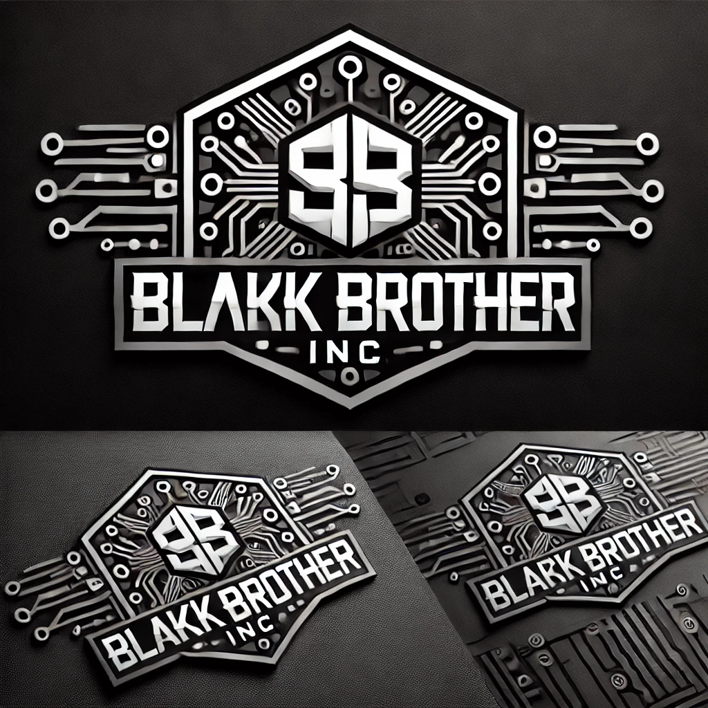

# 🚀 Node.js EC2 Deployment with CI/CD



## Automated Node.js Application Deployment to AWS EC2 with GitHub Actions


## Built With


## 📋 Table of Contents

- [Overview](#-overview)
- [Features](#-features)
- [Project Structure](#-project-structure)
- [Deployment Workflow](#-deployment-workflow)
- [Prerequisites](#-prerequisites)
- [Setup Instructions](#-setup-instructions)
- [GitHub Secrets Configuration](#-github-secrets-configuration)
- [Customization](#-customization)
- [Contributing](#-contributing)
- [License](#-license)

## 🔍 Overview

This project demonstrates a complete CI/CD pipeline for deploying a Node.js application to AWS EC2 instances using GitHub Actions. The workflow includes automated security scanning, testing, and deployment to production environments. The pipeline is triggered on every push to the main branch (excluding documentation changes) and ensures code quality and security before deployment.

The CI/CD pipeline includes:
- Automated security scanning with `npm audit`
- Artifact management for security reports
- Automated deployment to EC2 instances
- Nginx web server configuration
- Environment-specific deployments

## ✨ Features

- **Automated CI/CD Pipeline**: End-to-end automation from code push to deployment
- **Security Scanning**: Integrated npm audit for dependency vulnerability checks
- **Artifact Management**: Stores and tracks security reports
- **Selective Deployment**: Path-ignore configuration to prevent unnecessary deployments
- **Secure Credentials**: GitHub Secrets for sensitive information
- **Nginx Web Server**: High-performance web server configuration
- **Node.js Application**: Modern JavaScript runtime with Express.js
- **Automated Testing**: (Add your testing framework badges here when implemented)

## 📁 Project Structure

```markdown
ec2-deployment/
├── .github/
│   └── workflows/
│       └── ec2.yml          # GitHub Actions CI/CD workflow
├── app/
│   ├── public/             # Static files (HTML, CSS, images)
│   │   ├── assets/
│   │   │   └── img/      # Image assets
│   │   ├── index.html      # Main HTML file
│   │   └── style.css       # CSS styling
│   ├── server.js           # Node.js/Express server
│   └── package.json        # Dependencies and scripts
└── README.md               # Project documentation
```

## 🔄 CI/CD Pipeline Workflow

1. **Code Push**: Code is pushed to the main branch
   - Documentation changes are ignored via path-ignore
   - Security scanning is performed using `npm audit`
   - Security reports are generated and stored as artifacts

2. **Deployment**:
   - Code is deployed to the EC2 instance via SSH
   - Node.js and Nginx are automatically installed and configured
   - Application dependencies are installed
   - The application is served via Nginx reverse proxy

3. **Verification**:
   - Application is accessible via the EC2 instance's public IP/DNS
   - (Add your testing steps here when implemented)

## 📋 Prerequisites

- AWS account with multiple EC2 instances (for Development, Testing, and Production)
- SSH key pairs for each EC2 instance
- GitHub repository with environments configured
- Basic knowledge of GitHub Actions and environment secrets
- Understanding of web development fundamentals

## 🛠 Setup Instructions

### 1. EC2 Instance Setup

1. Launch an EC2 instance with Ubuntu
2. Configure security group to allow HTTP (port 80) and SSH (port 22)
3. Connect to your instance and ensure it's updated:

```bash
sudo apt-get update
sudo apt-get upgrade
```

### 2. Repository Setup

1. Clone this repository
2. Install dependencies:
   ```bash
   cd app
   npm install
   ```
3. Configure GitHub Secrets (see below)
4. Push changes to the main branch to trigger the CI/CD pipeline
5. Access your application at `http://your-ec2-ip:3000`

## 🔐 GitHub Secrets Configuration

Configure the following secrets in your GitHub repository environments (Development, Testing, Production):

| Secret Name | Description |
|-------------|-------------|
| `EC2_SSH_KEY` | Private SSH key for EC2 instance (content of .pem file) |
| `HOST_DNS` | Public DNS or IP of your EC2 instance |
| `EC2_USER` | Username for SSH connection (e.g., ubuntu, ec2-user) |
| `TARGET_DIR` | Target directory on EC2 (e.g., /home/ubuntu) |

Each environment (Development, Testing, Production) has its own set of these secrets, allowing for deployment to different servers.

## 🎨 Customization

### Web Application

- Update the static files in `app/public/`
- Replace `background.jpg` and `logo.png` with your own images
- Modify `index.html` to include your content
- Update `style.css` to match your branding

### Node.js Application

- The main application logic is in `app/server.js`
- Add your API routes and business logic here
- Install additional npm packages as needed

### CI/CD Pipeline

- The workflow is configured in `.github/workflows/ec2.yml`
- Add testing steps to the workflow when implementing tests
- Customize the deployment process as needed
- Configure environment-specific settings in GitHub repository secrets

## 👥 Contributing

Contributions are welcome! Please feel free to submit a Pull Request.

1. Fork the repository
2. Create your feature branch (`git checkout -b feature/amazing-feature`)
3. Commit your changes (`git commit -m 'Add some amazing feature'`)
4. Push to the branch (`git push origin feature/amazing-feature`)
5. Open a Pull Request

## 📄 License

This project is licensed under the MIT License - see the LICENSE file for details.

## 🔮 Future Enhancements

The EC2-Deploy project roadmap includes several exciting enhancements:

### Short-term Goals

- **Security Scanning Integration**: Implement SonarQube and Snyk scans for code quality and vulnerability detection
- ✅ **Multi-environment Support**: Extend deployment to development, testing, and production environments (Completed)
- **Monitoring Integration**: Add CloudWatch metrics and alerts for application health monitoring
- **HTTPS Implementation**: Configure SSL/TLS certificates for secure connections

### Mid-term Goals

- **Container Integration**: Migrate to Docker containers for consistent deployment
- **CI/CD Pipeline Expansion**: Add automated testing and quality gates
- **Security Automation**: Implement automated security checks with Snyk for dependency scanning and SonarQube for code quality analysis
- **Blue/Green Deployment**: Implement zero-downtime deployment strategy

### Long-term Vision

- **Infrastructure as Code**: Complete AWS infrastructure management using Terraform or CloudFormation
- **Microservices Architecture**: Break down the application into scalable microservices
- **Auto-scaling Configuration**: Implement dynamic scaling based on traffic patterns
- **Security-as-Code**: Fully integrate security scanning into the development lifecycle with SonarQube for static code analysis and Snyk for continuous vulnerability monitoring
- **Compliance Automation**: Implement automated compliance checks and reporting for regulatory requirements

---

## Technologies Used


Powered by BlakkBrother Inc.

© 2023 BlakkBrother Inc.
All rights reserved.
